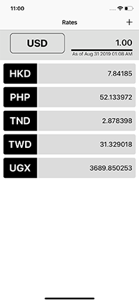

[](https://travis-ci.com/michaelhenry/Rates) [](#)

 

   

# API

This App uses api from [Currency Layer](https://currencylayer.com), Please check their [Documentation](https://currencylayer.com/documentation) for more information.

# SETUP

To configure the API, inside the [Info.plist](Rates/Info.plist), under `CurrencyLayer`,
replace `#YOUR_API_KEY` with your actual `APIkey`.

Example:
 
```
<?xml version="1.0" encoding="UTF-8"?>
<!DOCTYPE plist PUBLIC "-//Apple//DTD PLIST 1.0//EN" "http://www.apple.com/DTDs/PropertyList-1.0.dtd">
<plist version="1.0">
<dict>
	...
	<key>CurrencyLayer</key>
	<dict>
		<key>APIKey</key>
		<string>#YOUR_API_KEY</string>
	</dict>
</dict>
</plist>
```

# Unit Testing

This project uses the concept of mocking the request to avoid the hitting the server while still using the actual `API` request calls. All requests from the [APIService](Rates/Services/APIService.swift) are all hijacked and replaced  with the mock ones.

You can see all the response of the hijacked request can be found on [mock-responses](mock-responses) for more info. The `Path` and `File` under [mock-responses](mock-responses) represents the `Actual Endpoint` of the `Request`

Example:
endpoint: `/api/list`

```yml
- mock-responses:
  - api:
    - list:
```

> I'm planning to improve this by having a `Code Convention` for writting `HTTP Response` like adding custom `Response Headers`, react to diffrent `HTTPMethod` and `Query Params`, make it `pluggable` and easy to use. Please check this [Hijackr](https://github.com/michaelhenry/Hijackr) for more info in the Future.


Please see the [RatesTests](RatesTests) target for more info.

# Notes

- The App will only execute the actual `refresh` only after 30 minutes from the last successful request to avoid reaching the rate limitation of the API.
- Due to the limitation of the `Free API Key` from [Currency Layer](https://currencylayer.com), switching the `Base Currency` other than `USD` will alert an Error message like:

  > Access Restricted. Your current Subscription plan does not support Source Currency Switching.

	

  And to solve this issue, you have to subscribed to their [Paid Service](https://currencylayer.com/product).

# TODO

- [ ] Test cases for Failed request.
- [ ] Localization
- [ ] Empty State for List
- [ ] Custom Keyboard Input
- [ ] UI Test cases

# Contact

Fore mor informationm, please contact me@iamkel.net

